# Invicing System


This is a simple laravel billing system. You can use it to send html invoice emails.
Features: manage clients, manage users, manage, invoices, manage quotations, manage roles & permissions.


## Installation

Download and install composer

Clone this repo, open terminal and navigate to the folder containing the cloned repo, then run the following commands.
Before running the commands, create a .env file. _See the .env.example.._


```sh
composer install
php artisan migrate
php artisan db:seed
php artisan serve
```

Now on yr browser goto http://127.0.0.1:8000

Default email: admin@gmail.com

Default password: admin@_123

## Create Client

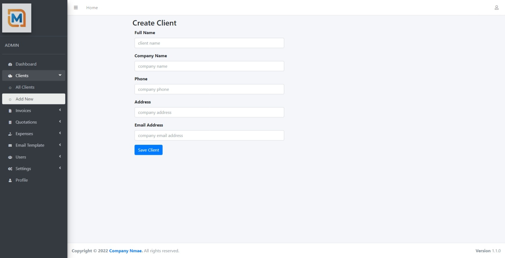

## Create Invoice

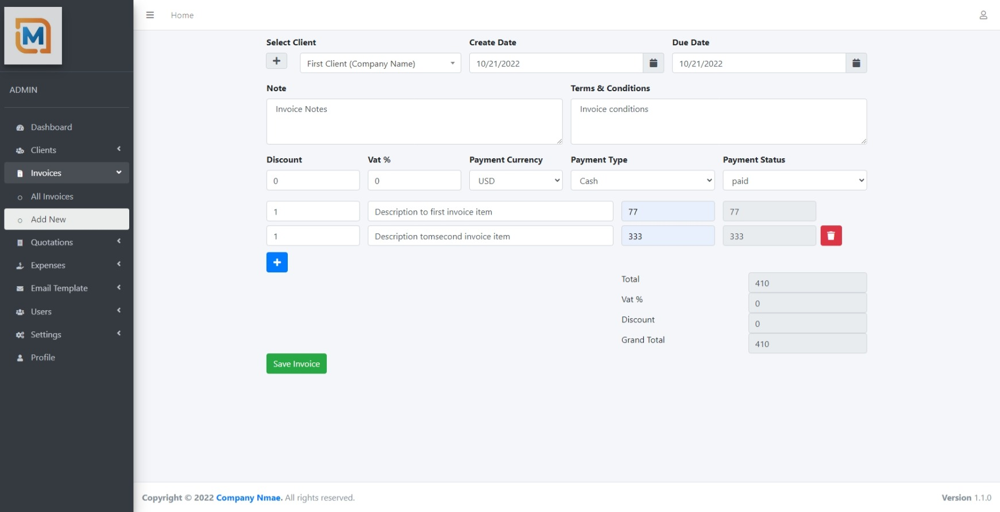

## View Invoice

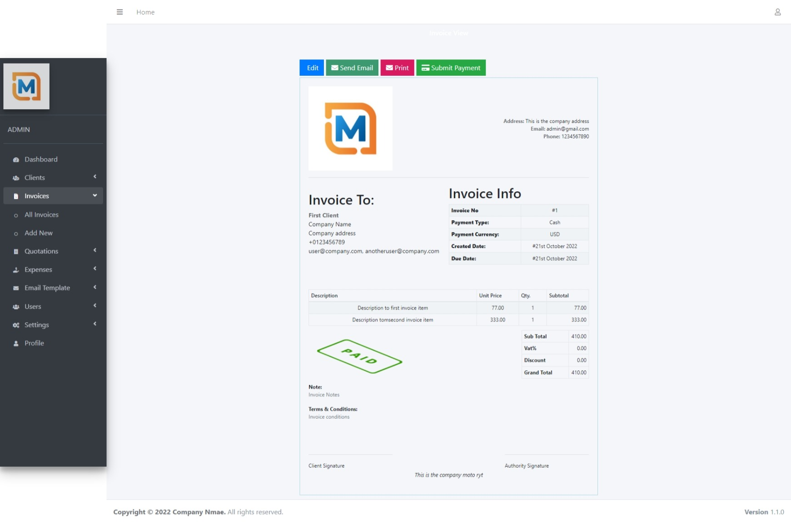

## Send Invoice

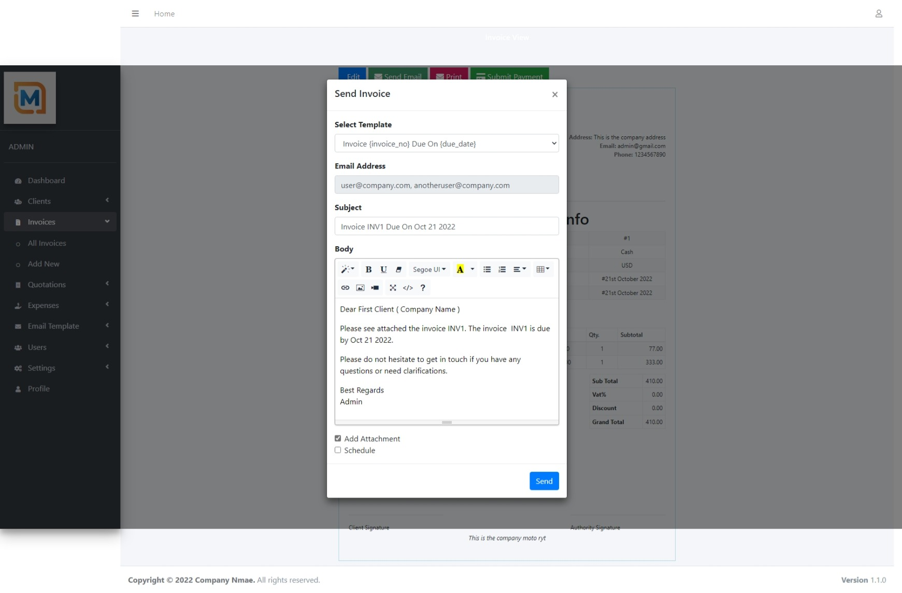

## Email templates

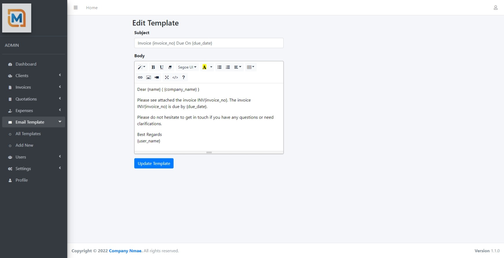

Here is a list of available variables to use when creating templates:
- {name} 
- {email}
- {company_name}
- {phone}
- {address}
- {total_due}
- {due_date}
- {user}
- {invoice_no}
- {quotation_no}
- {user_name}

## Roles

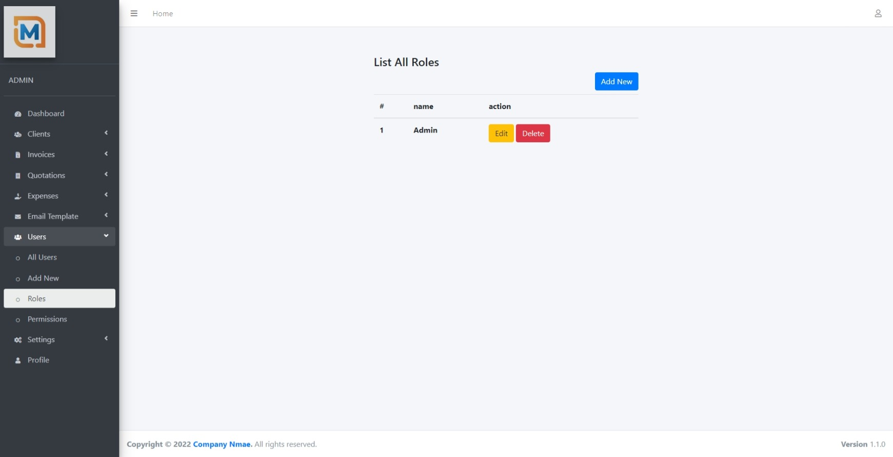

## Permissions

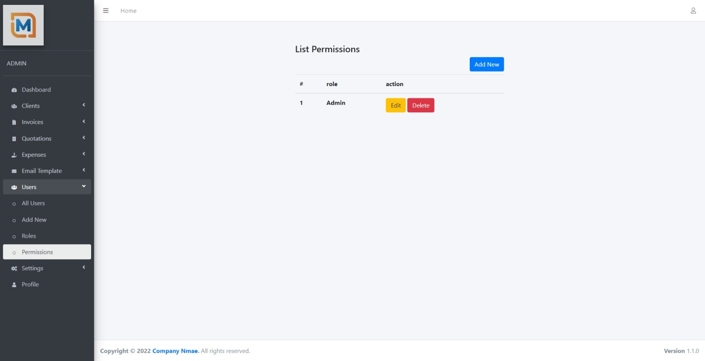

## Create Permision

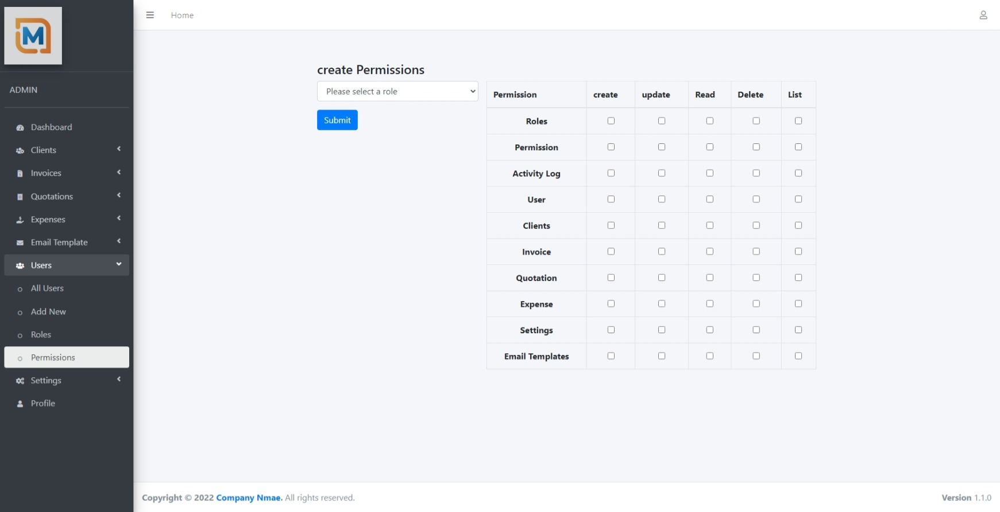

## Banking Details Settings

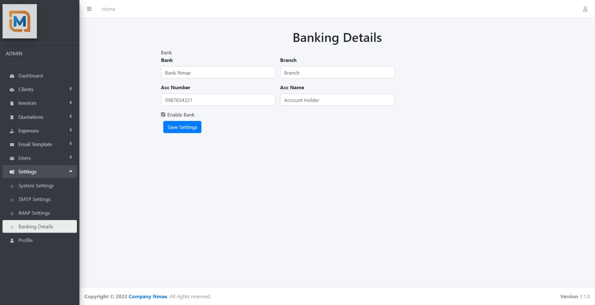

## SMTP Settings

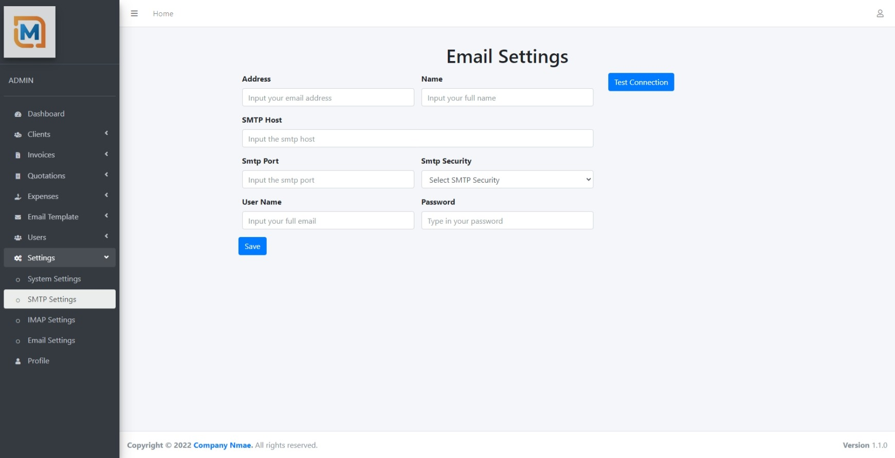

## General Settings

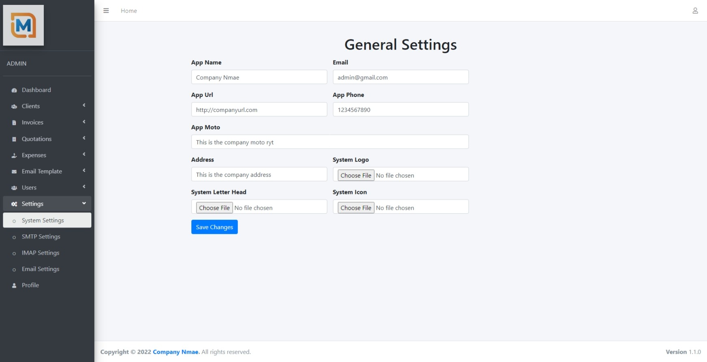

## Imap Settings

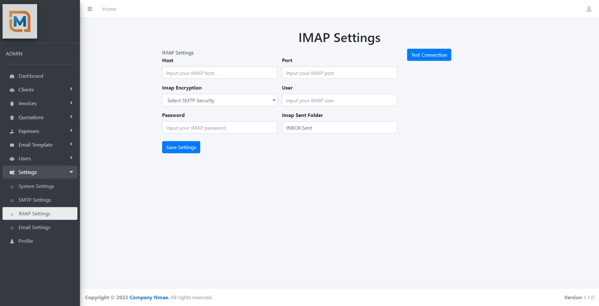


